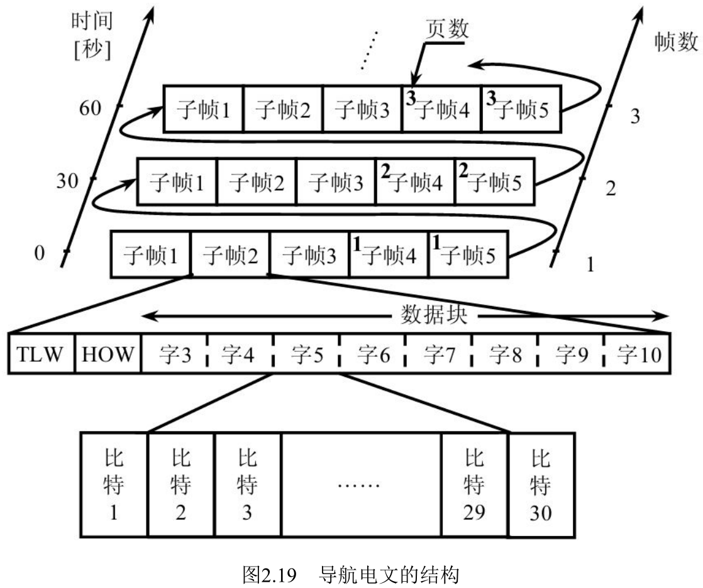
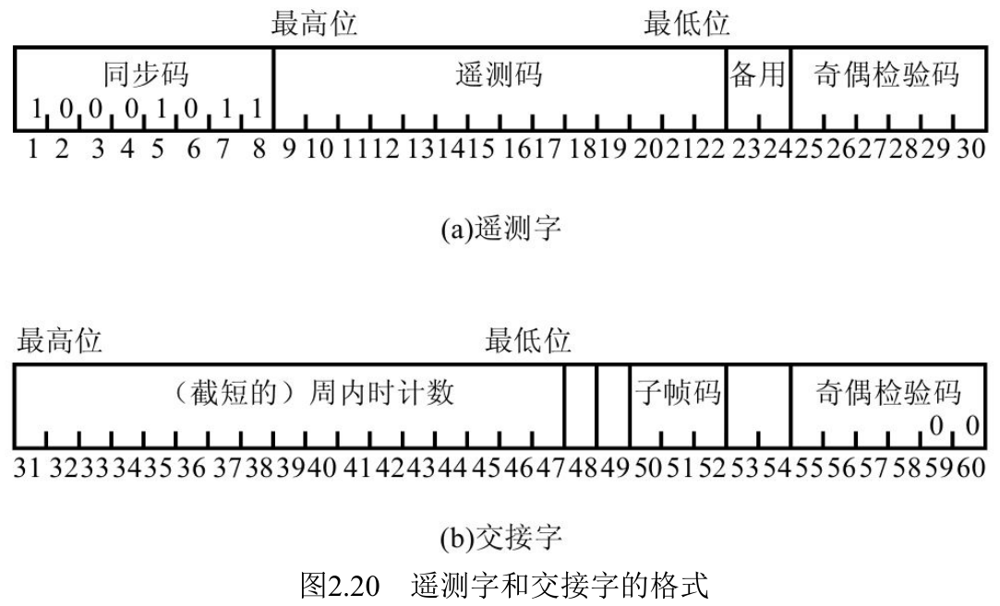
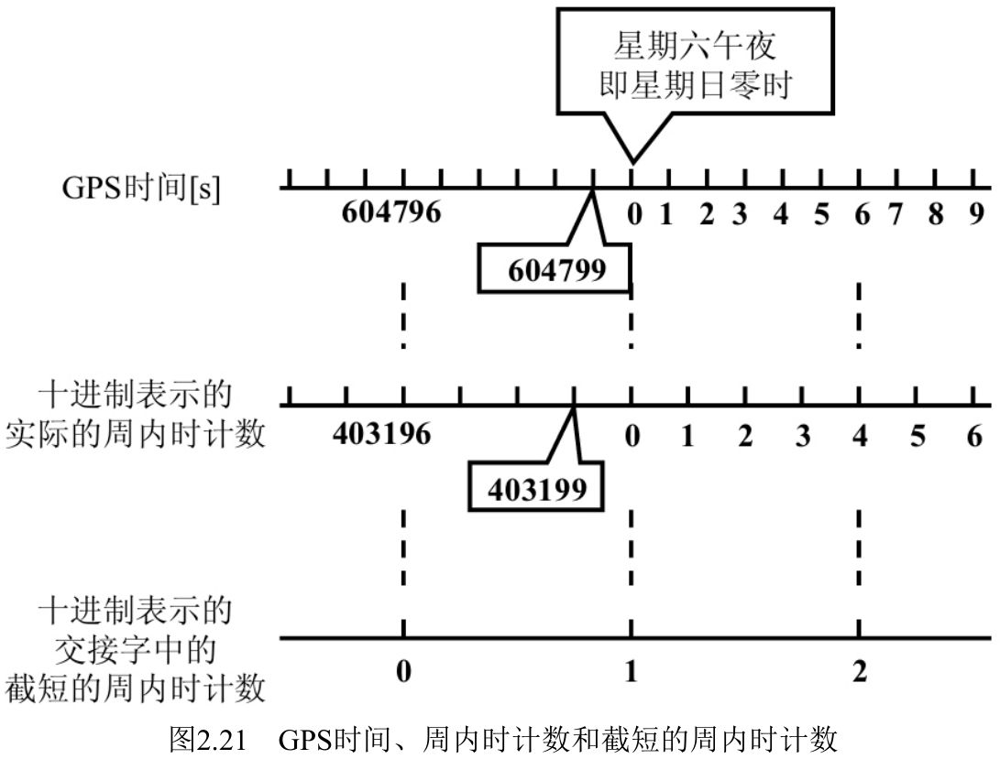
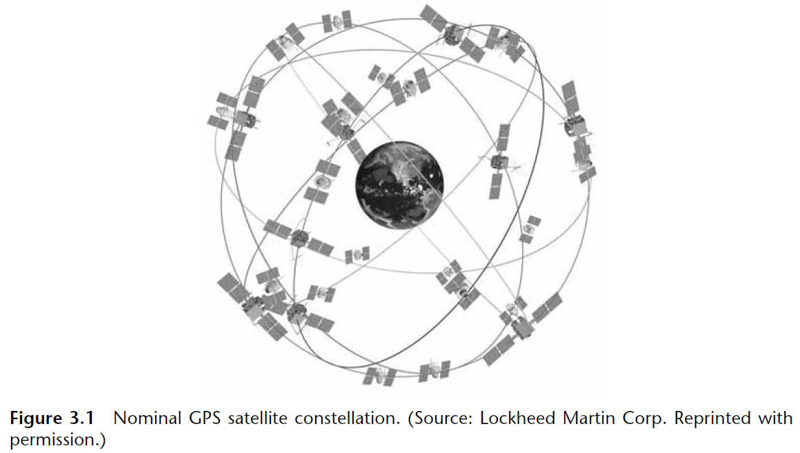
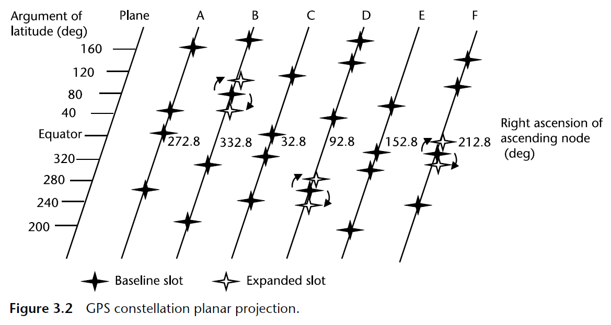
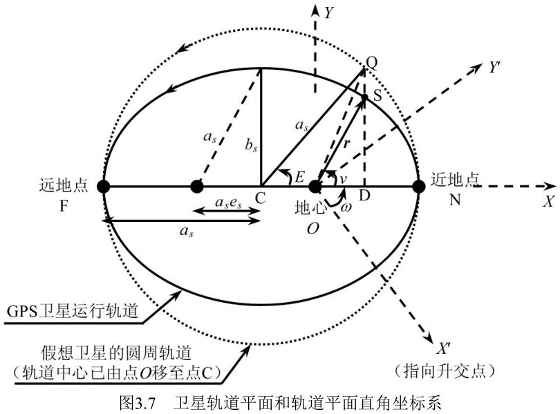

# 卫星位置、速度、时钟及方差的解算

## 2.5 导航电文

> 本节摘自《GPS原理与接收机设计（修订版）》谢钢 著，电子工业出版社，2.5节 导航电文

GPS用户接收机通过对接收到的卫星信号进行载波解调和伪码解扩，得到50bps的数据码，然后按照导航电文的格式可最终将数据码编译成导航电文。导航电文中含有时间、卫星运行轨道、电离层延时等用于定位的重要信息。

在此需要强调的是，《GPS界面控制文件（ICD-GPS-200C）》定义了GPS空间星座部分与用户设备部分之间的接口规范，详尽地解释了导航电文的格式与内容[2.2]。事实上，这一章约一半的内容来源于该文件，而它与前面提到的《GPS标准定位服务（SPS）信号说明书》均可以在国际互联网上免费下载。本节只介绍一些有关导航电文的必要知识，为学习接下来的几章打下基础。同时，随着对接下来几章内容的学习，读者将会对导航电文中各种信息数据的含义有一个更为清晰的认识。

### 2.5.1　导航电文的格式

卫星将导航电文以帧与子帧的结构形式编排成数据流$D(t)$。如图2.19所示，每颗卫星一帧接着一帧地发送导航电文，而在发送每帧电文时，卫星又以一子帧接着一子帧的形式进行。



每帧导航电文长1500比特，计30s，依次由5个子帧组成。每个子帧长300比特，计6s，依次由10个字组成。每个字长30比特，其最高位比特先被发送，而每一子帧中的每一字又均以6比特的奇偶检验码结束。我们已经知道，每一比特长20ms，其间C/A码重复20个周期。

每一子帧的前两个字分别为遥测字（TLW）与交接字（HOW），后八个字（即第3至第10字）则组成数据块。不同子帧内的数据块侧重不同方面的导航信息，其中第1子帧中的数据块通常称为第一数据块，第2子帧和第3子帧中的数据块合称为第二数据块，而剩下的第4子帧和第5子帧中的数据块则合称为第三数据块。当某颗卫星出现内存错误等故障时，它会在各大数据块的八个字里交替地发射1与0。

GPS对第三数据块采用了分页的结构，即一帧中的第4子帧和第5子帧为一页，然后在下一帧中的第4子帧和第5子帧继续发送下一页，而第三数据块的内容共占25页。因为一帧电文长30s，所以发送一套完整的导航电文总共需要花750s（即12.5min）的时间，然后整个导航电文的内容每12.5min重复一次。

在新的一个GPS星期（见2.5.3节）刚开始的那一刻，无论卫星在上一星期末尾正在播发哪一段导航电文，它将总是重新从第1子帧开始播发，而在第一次的第4子帧和第5子帧中将总是重新从第三数据块的第1页开始播发。当第1子帧、第2子帧和第3子帧的内容需要更新时，新的导航电文总是从帧的边沿处（即对应的GPS时间是30s的整数倍）开始播发。当第4子帧和第5子帧的内容需要更新时，新的导航电文可以在第4子帧和第5子帧中的任一页处开始播发。

### 2.5.2　遥测字（Telemetering Word, TLW）

每一子帧的第一个字均为遥测字（TLW），因而它在导航电文中每6s出现一次。图2.20(a)显示了遥测字内部码位的分布情况，其中第1比特至第8比特是一个二进制值固定在10001011的同步码，第9比特至第22比特提供特许用户所需要的信息，第23比特和第24比特保留，而最后6比特为奇偶检验码。



因为值既固定又已知的同步码是每一子帧的最先8个比特，所以GPS接收机可以用它来匹配接收到的数据码，进而搜索、锁定子帧的起始沿，为接下来按照相应格式正确解译二进制数据码提供了必要条件。如果接收机找到了一个卫星信号的子帧边沿，那么我们称该接收机对此卫星信号进入了子帧同步状态（或者说是帧同步状态）。

每一字中的奇偶检验码（汉明编码）可以帮助用户接收机检查经解调得到的字中是否包含错误比特，并且它还有一定的比特纠错功能。一个字中的奇偶检验码是通过对该字的前24比特和上一字的最后两个比特按照以下公式计算产生的[2.2]：

其中，$d_1$, $d_2$, $\dots$, $d_{24}$ 是24个原始数据比特，$D_1$, $D_2$, $\dots$, $D_{24}$ 是卫星实际发射的24个数据比特，$D_{25}$, $D_{26}$, $\dots$, $D_{30}$ 是卫星实际发射的6个奇偶检验码，$D^-_{29}$和$D^-_{30}$是卫星实际发射的上一字中的最后两位奇偶检验码。

### 2.5.3　交接字（Handover Word, HOW）

交接字（HOW）紧接遥测字之后，是每一子帧的第二个字，在导航电文中也是每6s出现一次，而图2.20(b)所示的是它的码位分布情况。

交接字的第1比特至第17比特（即子帧的第31比特至第47比特）是从Z计数器上得到的截短的周内时计数值。二进制Z计数器长29位，它的值由高10位的星期数（WN）和低19位的周内时（TOW）计数两部分组成，其中最高位先被播发，最低位最后被播发。如图2.18所示，Z计数器是将P（Y）码发生器产生的$X_1$序列作为输入信号，而周内时计数是从世界协调时间（UTC）大约每星期六午夜（即星期日零时）算起的$X_1$序列的周期累计数。2.2.5节告诉我们，序列$X_1$的周期为1.5s。因为一星期共计604 800s，所以一星期时间相当于403 200个$X_1$序列周期。如图2.21所示，周内时计数在以GPS卫星时钟计时的星期六午夜零时等于0，然后其值每1.5s加1而逐渐增大。到下一个星期六午夜零时，周内时计数从最大值403 199又重返为0，如此循环不已。最大周内时计数值403 199的二进制数表示长19位，而交接字只截取了周内时计数的最高17位，去掉了其最低2位，这相当于每6s截短的周内时计数增加1，其最大值为100 799。交接字中截短的周内时计数等价于从上个星期六午夜零时至当前时刻的卫星播发的子帧数，因而它乘以4可得在这一子帧结束、下一子帧开始时所对应的实际的周内时计数，或者说它乘以6可得在这一子帧结束、下一子帧开始时所对应的GPS时间（见3.2.2节）。对于每周重复一次的P码，因为其零相位发生在GPS零时刻，所以接收机可从C/A码信号的交接字那里获取截短的周内时计数，再由此确定当前观测时刻的P码相位，从而较快地捕获到P码。



交接字的第18比特是警告标志。当警告标志为1时，它提醒非特许用户自己承担使用该卫星信号的风险，因为该卫星第一数据块所提供的URA值（见2.5.4节）有可能比其真实值还要大。第19比特是A-S标志，其值为1时表示对该卫星实施了反电子欺骗措施。第20比特至第22比特是子帧识别标志，它共有如下5个有效二进制值：001表示该子帧是第1子帧，010表示第2子帧，依次类推，直至101表示第5子帧。若知道了当前子帧的识别标志，则接收机就可以按照这一子帧的相应格式解译数据码。第23比特至第24比特是通过求解得到的，其目的是使交接字的6位奇偶检验码以00结尾。

### 2.5.4　第一数据块

第一数据块包括第1子帧中的第3字至第10字，它又常称为时钟数据块。由一颗卫星播发的时钟数据块提供该卫星的时钟校正参数和健康状态等如下内容。

1. 星期数（WN）：星期数来自Z计数器的高10位，指代当前的GPS星期。每当周内时计数在星期六午夜零时从最大值跳回零的同时，星期数的值加1。因为星期数用10位二进制数表示，所以它的最大值为1023。若星期数在最大值1023时再加1，则星期数返回置0。上一次的星期数返零事件发生在以GPS时间计时的1999年8月21日午夜（即22日零时）。因为GPS时间每周循环一次，所以为了确切地表达一个时间值，我们在必要时必须同时指出GPS时间和GPS星期数。

2. 用户测距精度（URA）：用户测距精度是对所有由GPS地面监控部分和空间星座部分引起的测距误差大小的一个统计值，它是通过导航电文中的一个由4比特表示的用户测距精度因子N而提供给非特许用户的。用户测距精度因子N的值在0至15之间，每一个值对应于一个用户测距精度URA，而用户可以根据N值用以下公式估算URA值：

$$
\text{URA}=
    \begin{cases}
        2^{1+\frac{N}{2}},0\leq N\leq6\\
        2^{N-2},6<N<15
    \end{cases}
$$

URA值越大，则表示从该卫星信号中得到的GPS距离测量值的精度越低。当N等于15时，URA的估算值缺省，此时用户要自己承担使用该卫星的风险。

3. 卫星健康状况：若共计6比特的卫星健康状况的最高位是0，则表示导航电文全部正确。若它的最高位是1，则表示导航电文出错，而低5位又具体指出信号各部分的出错情况。

4. 时钟校正参数：$a_{f0}$，$a_{f1}$和$a_{f2}$是卫星时钟校正模型方程中的三个系数。另外，参数oct称为第一数据块的参考时间，它在时钟校正模型中被用做时间参考点。4.3.1节将会利用这些参数来修正卫星时钟钟差。

5. 群波延时校正值：群波延时校正值$T_{GD}$只适合于单频（L1或L2）接收机，而双频接收机则无需此项校正。单频接收机之所以有此项校正，是因为时钟校正参数$a_{f0}$是针对双频测量值而言的。群波这个概念将在4.3.3节中予以介绍，而该校正值的应用可参考4.3.1节。

6. 时钟数据期号（IODC）：用10比特表示的IODC是时钟数据块的“期刊号”，一个IODC值对应一套时钟校正参数。因为IODC的值在七天之内不会出现重复，所以它可以用来帮助用户接收机快速监测时钟校正参数是否已发生了变化：如果某卫星播发了一个新的IODC值，那么该卫星更新了时钟校正参数；否则，如果IODC值没有改变，那么时钟校正参数尚未被更新。如果时钟校正参数尚未被更新而接收机又已经完整地解译了当前这一套时钟校正参数，那么接收机就不必每30s去重复读解这一数据块中的时钟校正参数。

### 2.5.5　第二数据块

卫星信号的第2子帧和第3子帧数据块一起组成第二数据块，它提供该卫星自身的星历参数。

星历的原意是一张用来精确描述卫星在各个时刻的空间位置和运行速度的大表格。为了减少需要播发的数据量，GPS用开普勒方程来描述卫星的运行轨道，并通过最小二乘法逼近来求解方程中的各个系数。表2.4列出了由GPS卫星播发的共计16个开普勒系数的一套星历参数。我们将在下一章详细解释这16个参数的意义以及如何利用这些参数来计算卫星的位置和速度。

一套星历参数的有效期一般是以参考时间$t_{oe}$为中心的4小时之内，而超过此有效时段的星历经常被认为是过期且无效的。因为由过期星历参数计算得到的卫星轨道值一般会存在一个较大的误差，所以它们通常不能用于GPS的正常定位计算中。为了判断一套星历参数是否有效，正如上一小节所指出的那样，我们通常需要同时查看它的参考时间和星期数。

与IODC类似，卫星在第2子帧和第3子帧均播发一个8比特的星历数据期号（IODE），以此标记一套星历参数。IODC的值在6小时之内不会出现重复，并且它的值应当与第1子帧中IODC的低8位保持一致。一旦IODC的低8位与第2子帧和第3子帧中的IODE这三者之间有任何的不一致，则意味着卫星导航电文正处于新旧更替之际，而此时接收机应当接收、解译当前最新的一套卫星星历和时钟校正参数。卫星播发的第1子帧、第2子帧和第3子帧的内容通常每两小时更新一次，并且通常发生在整小时交界处。当更新完毕后，这三个子帧的数据块内容应当跟下一帧的这三个子帧的数据块内容保持一致。正是由于卫星在这三个子帧中重复播发相同的时钟校正和卫星星历参数，因而接收机在平均30s的时间内必然有机会从实时的卫星信号中完整地获取这三个子帧的数据块内容。

$$表2.4　GPS卫星星历参数\\
\begin{array}{ccl}
\hline
1 & t_{oe} & 星历的参考时刻\\
2 & \sqrt{a_s} & 卫星轨道半长轴a_s的平方根\\
3 & e_s & 轨道偏心率\\
4 & i_0 & t_{oe}时的轨道倾角\\
5 & \Omega_0 & 周内时等于0时的轨道升交点赤经\\
6 & \omega & t_{oe}时的轨道近地点幅角\\
7 & M_0 & t_{oe}时的平近点角\\
8 & \Delta n & 对平均角速度的校正值\\
9 & \frac{di}{dt} & 轨道倾角对时间的变化率\\
10 & \dot{\Omega} & 轨道升交点赤经对时间的变化率\\
11 & C_{uc} & 对纬度幅角余弦的校正值\\
12 & C_{us} & 对纬度幅角正弦的校正值\\
13 & C_{rc} & 对轨道半径余弦的校正值\\
14 & C_{rs} & 对轨道半径正弦的校正值\\
15 & C_{ic} & 对轨道倾角余弦的校正值\\
16 & C_{is} & 对轨道倾角正弦的校正值\\
\hline
\end{array}$$

### 2.5.6　第三数据块

第三数据块由第4子帧和第5子帧的数据块组成。每颗卫星播发的第三数据块主要提供所有（自身和其他）卫星的历书参数、电离层延时校正参数、GPS时间与UTC之间的关系以及卫星健康状况等数据信息。与前两个数据块不同，第三数据块的内容并不是接收机在实现定位前所急需获得的。

跟星历一样，历书的原意也是一张给出在不同时刻卫星位置的很大的表格，然而因为历书的精度比星历低，所以它又称为概略星历。表2.5列出了一套由GPS卫星播发的卫星历书参数（和历书型时钟校正参数），它们基本上与星历参数一一对应，只不过历书参数的个数较少。一套卫星历书不但比一套星历占用较少的比特，以便于卫星发射和接收机保存，而且有效期通常可达半年以上，远长于一套星历的4小时有效期。如果用户GPS接收机上保存着有效历书，并且用户大致知道自己当前所处的时间和位置，那么接收机可通过历书计算出各颗卫星在空间的大致位置，以此确定它们的可见性，这可使接收机避免去搜索、捕获那些不可见卫星的信号，从而减少接收机实现首次定位所需要的时间。除了表2.5所列的参数之外，每套历书通常还需要附带一个相应的星期数，用以帮助判断历书的有效性。不管是否有效，因为根据历书参数而计算得到的卫星位置值与卫星的真实位置值之间可能会存在一个很大的差异，所以历书通常不能用于GPS的定位运算中。在3.3.3节中，我们将对卫星星历与历书再一次进行比较。

$$表2.5　GPS卫星历书参数（概略星历）\\
\begin{array}{ccl}
\hline
1 & t_{oa} & 历书参考时间\\
2 & \sqrt{a_s} & 卫星轨道长半轴a_s的平方根\\
3 & e_s & 轨道偏心率\\
4 & \delta_i & 相对于0.3\pi的轨道倾角\\
5 & \Omega_0 & 周内时等于0时的轨道升交点赤经\\
6 & \omega & 轨道近地角距\\
7 & M_0 & t_{oa}时的平近点角\\
8 & \dot{\Omega} & 轨道升交点赤经对时间的变化率\\
9 & a_{f0} & 卫星时钟校正参数\\
10 & a_{f1} & 卫星时钟校正参数\\
\hline
\end{array}$$

一帧中的第4子帧和第5子帧这两子帧没有足够的比特空间来播发所有卫星的历书参数，于是第三数据块采用了分页的方法，即第4子帧和第5子帧的不同页上有着不同的数据内容及其格式。以下是第三数据块在一些页上所播发的一部分主要内容。

1. 第4子帧的第2，3，4，5，7，8，9和10页分别提供PRN 25至PRN 32的卫星历书。

2. 第4子帧的第18页提供电离层延时校正模型参数（$\alpha_0$, $\alpha_1$, $\alpha_2$, $\alpha_3$, $\beta_0$, $\beta_1$, $\beta_2$和$\beta_3$）和GPS时间与UTC之间关系的参数（$\Delta t_{LS}$, $A_0$, $A_1$和$t_{ot}$）。4.3.3节将利用这些电离层延时校正模型参数为单频接收机估算电离层延时，而3.2节将阐述GPS时间、UTC及两者之间的转换关系。

3. 第4子帧的第25页提供PRN 25至PRN 32的健康状况。第三数据块中的卫星健康状况值有可能与第一数据块中的卫星健康状况值不一致，这是因为两者的内容一般在不同的时刻得到更新。

4. 第5子帧的第1页至第24页分别提供PRN 1至PRN 24的历书。

5. 第5子帧的第25页提供PRN 1至PRN 24的健康状况、历书参考时间$t_{oa}$和历书参考星期数$WN_a$。历书参考星期数$WN_a$是相应的GPS星期数对256的模，故其值在0至255之间。

## 3.3 GPS卫星轨道的理论

> 本节摘自 Basics of the GPS Technique: Observation Equations, Geoffrey Blewitt

卫星星座设计为地面用户随时随地都能看到至少4颗卫星。为此，名义上有24颗GPS卫星分布在6个轨道平面上。下面解释GPS星座的几何结构。

### 确定椭圆轨道形状的开普勒轨道参数——半长轴a、离心率e

根据开普勒的轨道运动定律，每个轨道都近似呈椭圆形，地球的质心位于椭圆的焦点上。对于GPS轨道，椭圆的偏心率非常小(0.02)，几乎是圆形。椭圆的半长轴(最大半径)约为26,600公里，约为4个地球半径。

### 确定轨道取向的 3 个开普勒轨道参数——轨道倾角i、升交点赤经Ω、近地点幅角ω

6个轨道平面以与赤道成55度的倾角上升到赤道上方。它们跨越赤道从南半球上升到北半球的点称为“升交点赤经”。由于轨道平面是均匀分布的，所以六个上升交点之间的角度是60度。





### 平近点角M

卫星经过近地点的时刻 $\tau$ —— 真近点角 $v=\angle PFA$ —— 偏近点角 $E=\angle POB$ —— 平近点角 $M=E−e\sin E$


对平近点角M的含义的解释：



平近点角

$$M=E−e\sin E$$(1)

其中$e$为椭圆轨道偏心率

$$\frac{1}{2}a_s^2 M=\frac{1}{2}a_s^2 E−\frac{1}{2}a_s^2 e_s \sin E$$

其中，等号右边第一项等于图3.7中由点C和圆弧NQ构成的面积，第二项等于$S_{\Delta COQ}$，而它们两者之差为点O和圆弧NQ构成的面积，即等号左边的值。而M可以大致地视为圆弧NQ对地心O的角距$\angle NOQ$

从真近点角变换为平近点角之所以重要，是因为平近点角随时间而线性变化。

最后，近地点辐角是赤道与近地点的夹角。

综合起来，(偏心率、半长轴、轨道倾角、轨道升交点赤经、近地点经过时间/卫星的平近点角、近地点幅角)，这六个参数定义了卫星轨道。这些参数被称为开普勒元素。给定开普勒元素和当前时间，就有可能计算出卫星的坐标。

GPS卫星并不在完美的椭圆中运行，因此需要额外的参数。尽管如此，全球定位系统确实利用了开普勒定律，而且轨道是用开普勒式的参数描述的。必须增加额外的参数来解释非开普勒行为。即使这组参数也必须由控制部分每小时更新一次，以使它们保持足够有效。

### 3.3.3　卫星星历和历书参数

> 本节摘自《GPS原理与接收机设计（修订版）》谢钢 著，电子工业出版社

为了精确描述卫星的实际运行轨道，GPS采用了一套扩展后的开普勒轨道参数，它共计16个，并且已由上一章的表2.4给出。这套轨道参数通常称为星历参数，它包含在卫星所播发的导航电文的第二数据块中。我们在此简单介绍一下各个星历参数。

星历参数$t_{oe}$为一套星历参数的参考时间。若当前的GPS时间在$t_{oe}$前后的2小时之内，则这套星历参数被认为是有效的，也就是说，一套星历参数的有效期是以$t_{oe}$为中心的4小时。每颗卫星只播发关于其自身的星历，并且通常每两小时播发一套新的星历参数，但在某些特殊或紧急情况下，卫星也可能会加插播发一套新的星历参数。为了更好地鉴别一套星历的有效期，接收机通常在所获得的星历中添加一个其被播发时的星期数（WN）参量，从而消除由于不同星期存在相同GPS时间这一事实所可能引起的混淆。

星历参数$\Omega_0$, $i_0$, $\omega$, $\sqrt{a_s}$, $e_s$和$M_0$基本上与上一小节中介绍的6个开普勒轨道参数一一对应，所不同的是，GPS卫星实际上播发平近点角M而不是真近点角v，而这其中的原因已在上一小节中得到解释。此外，GPS并不认为这6个参数在4小时之内全部都是常数，它们中的有些可以视为与时间变化成简单的线性关系，而有些需要考虑谐波振动量。卫星星历用剩下的9个参数来直接或间接对前几个开普勒轨道参数进行摄动校正，其中$\Delta n$, $\frac{di}{dt}$, $\dot{\Omega}$分别对M, i和$\Omega$进行线性校正，$C_{us}$和$C_{uc}$一起对升交点角距（见例3.1的第6步）进行正、余弦调和校正，$C_{rs}$和$C_{rc}$对轨道半径进行正、余弦调和校正，而$C_{is}$和$C_{ic}$对轨道倾角进行正、余弦调和校正。这些摄动校正量星历参数的含义和运用将会在下一节的例子中得到更为具体的说明。

每颗卫星在播发其自身的星历参数的同时，它还播发包括自身在内的所有卫星的历书参数。2.5.6节中的表2.5已列出了关于一颗卫星的10个历书参数，其中$a_{f0}$和$a_{f1}$实际上是两个卫星时钟校正参数，剩下的8个历书参数大体上与8个星历参数一一对应。需要指出的是，以弧度（rad）为单位的历书参数$\delta i$，只有加上$0.3\pi$后才可与星历参数$i_0$对等比较，即[3.6]

$$i_0=\delta i+0.3\pi$$

同一颗卫星的星历与历书参数是由GPS地面监控部分相互独立地推算出来的，换句话说，它们之间的差异不但是参数个数多少的不同，而且描述同一个卫星轨道的星历和历书中通常有着互不相同的参数值。历书省去了星历中的一些摄动校正量，其中的一个主要原因是为了减少传播和保存历书所需的字节数。同时，对于有效期为半年以上的历书来说，星历中那些短期有效的摄动校正量没有多大意义，甚至根本不适于历书模型。

在以下两节，我们将分别介绍如何利用这些星历参数来计算卫星的空间位置和运行速度，并希望读者在计算过程中加深对各个参数的理解。这一计算方法和过程同样完全适合于利用历书参数来计算卫星的位置和速度，只是在计算过程中将星历所包含但历书所没有的那些摄动校正参数值全部赋值为零。一般来说，根据有效星历得到的卫星位置与速度值相当准确，其中三维位置误差的均方差大致为3～5m，可用于GPS定位与定速计算；而从有效历书得到的卫星位置与速度值准确度不高，一般只能用于接收机对卫星信号的搜索和捕获[3.29]。GPS卫星实际播发过的历书可从[navcen.uscg.gov](navcen.uscg.gov)网页上下载，而播发过的星历则可从[cddis.gsfc.nasa.gov](cddis.gsfc.nasa.gov)网页上下载。

## 3.4 卫星空间位置的计算

$$表2.3　卫星ECEF位置矢量的计算\\
\begin{array}{c|ll}
\hline
1 & a=(\sqrt{a})^2 & 半长轴\\
2 & n=\sqrt{\frac{\mu}{a^3}}+\Delta n & 经校正的平均角速度，\mu=398600.5\times10^8m^3/s^2\\
3 & t_k=t-t_{0e} & 从星历历元算起的时间\\
4 & M_k=M_0+n(t_k) & 平近点角\\
5 & M_k=E_k-e\sin E_k & 偏近点角(必须用迭代法解出E_k)\\
6 & \begin{matrix}
        \sin v_k=\frac{\sqrt{1-e^2}\sin E_k}{1-e\cos E_k}\\
        \cos v_k=\frac{\cos E_k-e}{1-e\cos E_k}
    \end{matrix} & 真近点角\\
7 & \phi_k=v_k+\omega & 纬度值\\
8 & \delta\phi_k=C_{us}\sin(2\phi_k)+C_{uc}\cos (2\phi_k) & 纬度校正值\\
9 & \delta r_k=C_{rs}\sin(2\phi_k)+C_{rc}\cos (2\phi_k) & 半径校正值\\
10 & \delta i_k=C_{is}\sin(2\phi_k)+C_{ic}\cos (2\phi_k) & 倾角校正值\\
11 & u_k=\phi_k+\delta\phi_k & 经校正的纬度值\\
12 & r_k=a(1-e\cos E_k)+\delta r_k & 经校正的半径\\
13 & i_k=i_0+(di/dt)t_k+\delta i_k & 经校正的倾角\\
14 & \Omega_k=\Omega_0+(\dot{\Omega}-\dot{\Omega_e})t_k-\dot{\Omega_e}t_{0e} & 经校正的升交点经度\\
15 & x_p=r_k \cos  u_k & 在轨道面中的x位置\\
16 & y_p=r_k\sin u_k & 在轨道面中的y位置\\
17 & x_s=x_p\cos \Omega_k-y_p\cos i_k\sin\Omega_k & ECEF x坐标\\
18 & y_s=x_p\sin\Omega_k+y_p\cos i_k\cos\Omega_k & ECEF y坐标\\
19 & z_p=y_p\sin i_k & ECEF z坐标\\
\hline
\end{array}$$

利用星历参数计算出GPS卫星在某一时刻的空间位置是GPS接收机为实现定位而必须完成的重要一步，而本节将通过一个实际例子来详细解释这一计算方法和步骤。尽管这一计算通常需要双精度浮点运算，但是因限于篇幅，我们只显示各个参数和变量小数点后的若干位数字。另外，因为星历中的角度参数对卫星位置的计算值非常敏感，所以《GPS界面控制文件》规定$\pi$的值统一取为3.141 592 653 589 8。

【例3.1】 以下是一颗卫星（PRN 1）在某日播发的一组星历参数：

1. $t_{oe}=244 800$
2. $\sqrt{a_s}=5153.655 31$
3. $e_s=0.005 912 038 265$
4. $i_0=0.984 840 794 3$
5. $\Omega_0=1.038 062 244$
6. $\omega=-1.717 457 876$
7. $M_0=-1.064 739 758$
8. $\Delta n=4.249 105 564\times10^{-9}$
9. $\frac{di}{dt}=7.422 851 197\times10^{-51}$
10. $\dot{\Omega}=-8.151 768 125\times10^{-9}$
11. $C_{uc}=3.054 738 045\times10^{-7}$
12. $C_{us}=2.237 036 824×10^{-6}$
13. $C_{rc}=350.531 25$
14. $C_{rs}=2.531 25$
15. $C_{ic}=-8.381 903 172\times10^{-8}$
16. $C_{is}=8.940 696 716\times10^{-8}$

以上这些参数值完全是按照《GPS界面控制文件》的规则编译出来的，它们均有常规、默认的单位和比例[3.6]。试根据这套星历参数，计算此卫星在信号发射时刻t（GPS时间）为239 050.722 3s时的空间位置。

解： 参照由文献[3.6]提供的计算方法，我们将这一计算过程分解成以下几步。

### 第1步：计算规化时间 $t_k$

卫星星历给出的轨道参数是以星历参考时间$t_{oe}$作为基准的。为了得到各个轨道参数在t时刻的值，我们必须先求出t时刻与参考时间$t_{oe}$间的差异，即

$$ t_k=t-t_{oe} $$(2)

上式得到的$t_k$称为相对于$t_{oe}$的规化时间。

对于一个有效星历而言，t值应当在$t_{oe}$前后的两小时之间，即$t_k$的绝对值必须小于7200s。因为GPS时间在每周六午夜零时重新置零，所以由上式计算得到的$t_k$值有时会引入604 800s的偏差。当由式(2)计算得到的$t_k$大于302 400s时，则$t_k$应减去604 800s；否则，当$t_k$小于-302 400s时，则$t_k$应加上604 800s。如果星历的星期数不等于当前的星期数，比如这套星历是接收机很久以前所保存的，那么两者的星期数之差必须转换成秒数后加到由式(2)计算所得的$t_k$上。正如3.3.3节所指出的那样，我们需要同时检查星历的参考时间和星期数才能决定它是否仍在当前星期和当前t时刻有效。

假定星历的星期数与当前的星期数相等，那么将t和由星历给出的$t_{oe}$代入式(2)，可得$t_k=-5749.277 700$s。该规化时间值已在$\pm302 400$s的范围之内，同时它的绝对值也小于7200s。在GPS和GPS接收机均正常运行的情况下，$t_k$值一般应该是个负数。

有了规化时间$t_k$，那么我们下一步可以根据模型求得在信号发射时刻t（即在规化时间$t_k$）的各个轨道参数。我们将在各个星历参数后面添加一个下标“k”，以此代表它们在这一规化时间$t_k$时的值。

### 第2步：计算卫星的平均角速度 $n$

我们将卫星星历给出的$a_s$值代入式（3.36），可得那颗在圆周轨道上运行的假想卫星的（平均）角速度$n_0=1.458 555\times10^{-4}$。校正后的卫星平均角速度n为

$$n=n_0+\Delta n$$(3)

而将星历提供的平均角速度校正值$\Delta n$代入上式，得$n=1.458 598\times10^{-4}rad/s$。

### 第3步：计算信号发射时刻的平近点角 $M_k$

将星历给出的$M_0$代入以下的线性模型公式：

$$M_k=M_0+nt_k$$(4)

可得$t_k$时的平近点角$M_k=-1.903 328$rad。由于此$M_k$值不在0与2π之间，故可将$M_k$值加上$2\pi$后变成4.379 857 rad。事实上，式(4)只是式（3.37）的另一种表达形式。

### 第4步：计算信号发射时刻的偏近点角 $E_k$

给出了平近点角$M_k$和星历参数$e_s$，我们通常可以运用迭代法将偏近点角$E_k$从开普勒方程(1)中求解出来。$E_k$的迭代初始值$E_0$可置为$M_k$，而根据式（3.39）所计算出的前两次迭代结果依次为4.374 269与4.374 280。在这一步，我们解得$E_k=4.374 280$rad。

### 第5步：计算信号发射时刻的真近点角 $v_k$

将$E_k$和$e_s$代入式（3.44）、式（3.45）和式（3.46），得 $\cos v_k=-0.336 955 0$ 和 $\sin v_k=-0.941 520 8$，从而求得值在 $(-\pi,+\pi]$ 之间的真近点角$v_k=-1.914 477$rad。

### 第6步：计算信号发射时刻的升交点角距 $\Phi_k$

将卫星星历给出的$\omega$代入下式：

$$\Phi_k=v_k+\omega$$(5)

得到升交点角距$\Phi_k=-3.631 935$rad。如图3.8所示，升交点角距$\Phi_k$是卫星当前位置点S与升交点相对于地心Ο的夹角。

### 第7步：计算信号发射时刻的摄动校正项$\delta u_k$, $\delta r_k$和$\delta i_k$

将星历参数$C_{uc}$ , $C_{us}$ , $C_{rc}$ , $C_{rs}$ , $C_{ic}$ , $C_{is}$和由上一步得到的升交点角距$\theta_k$代入以下各式：

$$\delta u_k=C_{us}\sin(2\Phi_k)+C_{uc}\cos(2\Phi_k)$$(6)

$$\delta r_k=C_{rs}\sin(2\Phi_k)+C_{rc}\cos(2\Phi_k)$$(7)

$$\delta i_k=C_{is}\sin(2\Phi_k)+C_{ic}\cos(2\Phi_k)$$(8)

可得二次谐波摄动校正量$\delta u_k=-1.688 724\times10^{-6}$, $\delta r_k=192.951 246$和$\delta i_k=-1.209 277\times10^{-7}$。

### 第8步：计算摄动校正后的升交点角距 $u_k$、卫星矢径长度 $r_k$ 和轨道倾角 $i_k$

将上一步计算得到的摄动校正量代入以下各式：

$$u_k=\Phi_k+\delta u_k$$(9)

$$r_k=a_s(1-e_s\cos E_k)+\delta r_k$$(10)

$$i_k=i_0+\frac{di}{dt}t_k+\delta i_k$$(11)

可得$u_k=-3.631 937$, $r_k=26 612 441.68$和$i_k=0.9 848 407$，其中参数$a_s$, $e_s$, $i_0$和$\frac{di}{dt}$均由卫星星历给出。

### 第9步：计算信号发射时刻卫星在轨道平面的位置 $(x_k',y_k')$

通过以下公式将极坐标$(r_k, u_k)$转换成在轨道平面直角坐标系$(X',Y')$中的坐标$(x_k',y_k')$：

$$
x_k'=r_k\cos u_k\\
y_k'=r_k\sin u_k
$$(12)

得$x_k'=-23 476 720.79$m和$y_k'=12 532 582.86$m，同时$z_k'=0$。如图3.8所示，这里的直角坐标系的X'轴是由地心指向卫星升交点，而不是指向近地点，这正是式（3.48）与式(12)的不同之处。

### 第10步：计算信号发射时刻的升交点赤经 $\Omega_k$

升交点赤经的线性模型如下：

$$\Omega_k=\Omega_0+(\dot{\Omega}-\dot{\Omega_e})t_k-\dot{\Omega_e}t_{oe}$$(13)

由此可得$\Omega_k =-16.393 745$rad，这等价于值在0至$2\pi$之间的2.455 811 rad。在式(13)中，$\Omega_0$和$\dot{\Omega}$由卫星星历给出，而表3.1给出了地球自转角速度常数$\dot{\Omega_e}$的值。注意，式(13)已经考虑了地球自转对卫星升交点与格林尼治子午面之间相对位置关系的影响，也就是说，由上式得到的$\Omega_k$值直接是t时刻的卫星升交点在t时刻的WGS-84大地坐标系中的经度，这便于下一步将卫星位置从轨道平面直角坐标转换到WGS-84地心地固直角坐标。

### 第11步：计算卫星在WGS-84地心地固直角坐标系$(X_T, Y_T, Z_T)$中的坐标$(x_k, y_k, z_k)$

如图3.8所示，轨道平面直角坐标系$(X', Y', Z')$先绕X'轴旋转$(-i_k)$，再绕旋转后的Z′轴旋转$(-\Omega k)$，由此转变成WGS-84地心地固直角坐标系$(X_T, Y_T, Z_T)$。先后利用坐标变换公式（3.11）和式（3.10），得

$$\begin{array}{l}
x_k=x_k'\cos \Omega_k-y_k'\cos i_k\sin \Omega_k\\
y_k=x_k'\sin \Omega_k+y_k'\cos i_k\cos \Omega_k\\
z_k=y_k' \sin i_k
\end{array}$$(14)

代入数值后，最终得到了t时刻该卫星在WGS-84地心地固直角坐标系中以米为单位的坐标值，即$(13 780 293.30,-20 230 949.12，10 441 947.44)$。

## 3.5　卫星运行速度的计算

如果我们只要求用户GPS接收机实现定位，那么一般来说计算出各颗可见卫星的空间位置应当就足够了。如果我们还要求确定用户的运动速度，那么接收机还需要计算出各颗卫星的运行速度。这一节将继续上一节中的例子，从而详细讲解如何利用卫星星历参数来计算卫星运行速度的方法和步骤。

简单地讲，卫星的运行速度等于卫星的空间位置对时间的变化率。卫星无摄运动的速度公式（3.49）是通过对位置公式（3.48）求导得到的，那么类似地，我们可通过对式求导来推导出以下用星历参数表达的卫星速度公式[3.16, 3.30]：

$$
\begin{aligned}
\dot{x}_k&=(\dot{x_k}'-\dot{y_k}'\dot{\Omega_k}\cos i_k)\cos\Omega_k-(x_k'\dot{\Omega_k}+\dot{y_k}'\cos i_k-y_k'\dot{i_k}\sin i_k)\sin\Omega_k\\
         &=-y_k\dot\Omega_k-(\dot{y_k}'\cos i_k-z_k\dot{i_k})\sin\Omega_k+\dot{x_k}'\cos\Omega_k\\
\dot{y}_k&=(\dot{x_k}'-\dot{y_k}'\dot{\Omega_k}\cos i_k)\sin\Omega_k+(x_k'\dot{\Omega_k}+\dot{y_k}'\cos i_k-y_k'\dot{i_k}\sin i_k)\cos\Omega_k\\
         &=x_k\dot\Omega_k+(\dot{y_k}'\cos i_k-z_k\dot{i_k})\cos\Omega_k+\dot{x_k}'\sin\Omega_k\\
\dot{z}_k&=\dot{y_k}'\sin i_k+y_k'\dot{i_k}\cos i_k
\end{aligned}
$$(15)

需要提醒的是，式(14)等号右边的所有参量全部都是个关于时间的函数，而我们接下来要做的是推导出式(15)中等号右边的各个导数值。

式(15)中的$\dot{x_k}'$和$\dot{y_k}'$可由式(12)对时间求导得到，即

$$
\dot{x_k}'=\dot{r_k}\cos u_k-r_k\dot{u_k}\sin u_k\\
\dot{y_k}'=\dot{r_k}\sin u_k+r_k\dot{u_k}\cos u_k
$$(16)

其中，$\dot{u_k}$, $\dot{r_k}$, $\dot{i_k}$和$\dot{\Omega_k}$可分别由式(9)、式(10)、式(11)和式(13)对时间求导得到，即

$$\dot{u_k}=\dot\Phi_k'+\delta\dot u_k'$$(17)

$$\dot{r_k}=a_se_s\dot E_k\sin E_k+\delta\dot r_k$$(18)

$$\dot{i_k}=\dot i+\delta\dot i_k$$(19)

$$\dot{\Omega_k}=\dot{\Omega}-\dot{\Omega_e}$$(20)

其中，$\delta\dot u_k$, $\delta\dot r_k$ 和 $\delta\dot i_k$可分别由式(6)、式(7)和式(8)对时间求导得到，即

$$\delta\dot u_k=2\dot\Phi_k(C_{us}\cos(2\Phi_k)-C_{uc}\sin(2\Phi_k))$$(21)

$$\delta\dot r_k=2\dot\Phi_k(C_{rs}\cos(2\Phi_k)-C_{rc}\sin(2\Phi_k))$$(22)

$$\delta\dot i_k=2\dot\Phi_k(C_{is}\cos(2\Phi_k)-C_{ic}\sin(2\Phi_k))$$(23)

其中， 可由式(5)对时间求导得到，即

$$\dot\Phi_k=\dot v_k$$(24)

而对式（3.44）进行求导和整理后可得

$$\dot v_k=\frac{(1+e_s\cos v_k)\dot{E}_k\sin E_k}{(1-e_s\cos E_k)\sin v_k}=\frac{\sqrt{1-e_s^2}\dot{E}_k}{1-e_s\cos E_k}$$(25)

其中，式(18)和(25)中的$\dot E_k$可由式（3.38）对时间求导得到，即

$$\dot{E}_k=\frac{\dot{M}_k}{1-e_s\cos E_k}$$(26)

而由式（3.53）得

$$\dot{M}_k=n$$

至此，我们得到了式(15)中等号右边的各个参变量。

【例3.2】 接着上一节的例3.1，试根据给出的卫星星历参数计算该卫星在信号发射t时刻时的运行速度。

解：紧接着例3.1的第11步，我们将卫星运行速度的计算过程分成以下几步。

### 第12步：计算信号发射时刻的 $\dot{E}_k$

由式(27)和式(26)得 $\dot{E}_k=1.455743\times10^{-4}$。

### 第13步：计算信号发射时刻的 $\dot\Phi_k$

由式(25)和式(24)得 $\dot\Phi_k=\dot v_k=1.452868\times10^{-4}$。

### 第14步：计算信号发射时刻的摄动校正项 $\delta\dot u_k$, $\delta\dot r_k$ 和 $\delta\dot i_k$

由式(21)、式(22)和式(23)分别得 $\delta\dot u_k=4.354592\times10^{-10}$, $\delta\dot r_k=0.08503854$ 和 $\delta\dot i_k=-5.780 267\times10^{-12}$。

### 第15步：计算信号发射时刻的 $\dot u_k$, $\dot r_k$, $\dot i_k$ 和 $\dot\Omega_k$

由式(17)、式(18)、式(19)和式(20)分别得 $\dot u_k=1.452873\times10^{-4}$, $\dot r_k=-21.47954$, $\dot i_k=-5.780 267×10^{-12}$ 和 $\dot\Omega_k=-7.292930\times10^{-5}$。

### 第16步：计算信号发射时刻卫星在轨道平面直角坐标系中的速度 $(\dot x_k', \dot y_k')$

由式(16)得 $\dot x_k'=-1801.876$m/s 和 $\dot y_k'=-3420.984$m/s。

### 第17步：计算卫星在WGS-84地心地固直角坐标系 $(X_T, Y_T, Z_T)$ 中的速度 $(\dot x_k, \dot y_k, \dot z_k)$

由式(15)得 $\dot x_k=1117.116$m/s, $\dot y_k=-681.974$m/s 和 $\dot z_k=-2850.309$m/s。

例3.1和例3.2的计算突出了WGS-84地心地固直角坐标系和GPS时间的重要性。由GPS卫星星历与历书参数计算得到的卫星位置和运行速度均表达于WGS-84坐标系之中，同时WGS-84又提供了计算中所需要的有关地球的常数。

## 3.6　卫星轨道的插值计算

> 详见《GPS原理与接收机设计（修订版）》谢钢 著，电子工业出版社，3.6节

# rtklib 代码实现——satposs()

## 参数列表

```c
      gtime_t teph ;  /*  I   time to select ephemeris (gpst) 用来选择星历的gps时刻             */
const obsd_t *obs  ;  /*  I   observation data 原始观测量                                      */
      int    n     ;  /*  I   number of observation data 原始观测量的个数                       */
const nav_t  *nav  ;  /*  I   navigation data 导航电文                                         */
      int    ephopt;  /*  I   ephemeris option (EPHOPT_???) 星历配置项                         */
      double *rs   ;  /*  O   satellite positions and velocities (ecef) 卫星的位置和速度        */
      double *dts  ;  /*  O   satellite clocks 卫星的钟差和钟漂                                 */
      double *var  ;  /*  O   sat position and clock error variances (m^2) 卫星位置和时钟的方差 */
      int    *svh  ;  /*  O   sat health flag (-1:correction not available) 卫星的健康标志位   */
```

注（变量维度及单位）：
```c
/* satellite positions and clocks ----------------------------------------------
* compute satellite positions, velocities and clocks
* return : none
* notes  : rs [(0:2)+i*6]= obs[i] sat position {x,y,z} (m)
*          rs [(3:5)+i*6]= obs[i] sat velocity {vx,vy,vz} (m/s)
*          dts[(0:1)+i*2]= obs[i] sat clock {bias,drift} (s|s/s)
*          var[i]        = obs[i] sat position and clock error variance (m^2)
*          svh[i]        = obs[i] sat health flag
*          if no navigation data, set 0 to rs[], dts[], var[] and svh[]
*          satellite position and clock are values at signal transmission time
*          satellite position is referenced to antenna phase center
*          satellite clock does not include code bias correction (tgd or bgd)
*          any pseudorange and broadcast ephemeris are always needed to get
*          signal transmission time
*-----------------------------------------------------------------------------*/
```

```c
extern void satposs(gtime_t teph, const obsd_t *obs, int n, const nav_t *nav,
                    int ephopt, double *rs, double *dts, double *var, int *svh)
{
    gtime_t time[2*MAXOBS]={{0}};
    double dt,pr;
    int i,j;
    
    trace(3,"satposs : teph=%s n=%d ephopt=%d\n",time_str(teph,3),n,ephopt);
    // 遍历每一个原始观测量
    for (i=0;i<n&&i<2*MAXOBS;i++) {
        // 初始化卫星的位置速度、钟差钟漂、方差和健康标志位
        for (j=0;j<6;j++) rs [j+i*6]=0.0;
        for (j=0;j<2;j++) dts[j+i*2]=0.0;
        var[i]=0.0; svh[i]=0;
        
        /* search any pseudorange 对第i个原始观测量，若没有伪距，跳到下一次循环 */
        for (j=0,pr=0.0;j<NFREQ;j++) if ((pr=obs[i].P[j])!=0.0) break;
        if (j>=NFREQ) {
            trace(3,"no pseudorange %s sat=%2d\n",time_str(obs[i].time,3),obs[i].sat);
            continue;
        }

        /* transmission time by satellite clock 卫星信号的发射时间 */
        time[i]=timeadd(obs[i].time,-pr/CLIGHT);
        
        /* satellite clock bias by broadcast ephemeris 用广播星历计算卫星钟差dt（不包含相对论效应的钟差和TGD），仅作为 satpos() 的参数计算卫星的位置速度和更精确的钟差dts  */
        if (!ephclk(time[i],teph,obs[i].sat,nav,&dt)) {
            trace(3,"no broadcast clock %s sat=%2d\n",time_str(time[i],3),obs[i].sat);
            continue;
        }
        time[i]=timeadd(time[i],-dt);
        
        /* satellite position and clock at transmission time 计算卫星在信号发射时的位置速度、钟差钟漂和方差，取得健康标志位 */
        if (!satpos(time[i],teph,obs[i].sat,ephopt,nav,rs+i*6,dts+i*2,var+i,
                    svh+i)) {
            trace(3,"no ephemeris %s sat=%2d\n",time_str(time[i],3),obs[i].sat);
            continue;
        }
        /* if no precise clock available, use broadcast clock instead */
        if (dts[i*2]==0.0) {
            if (!ephclk(time[i],teph,obs[i].sat,nav,dts+i*2)) continue;
            dts[1+i*2]=0.0;
            *var=SQR(STD_BRDCCLK);
        }
    }
    for (i=0;i<n&&i<2*MAXOBS;i++) {
        trace(4,"%s sat=%2d rs=%13.3f %13.3f %13.3f dts=%12.3f var=%7.3f svh=%02X\n",
              time_str(time[i],6),obs[i].sat,rs[i*6],rs[1+i*6],rs[2+i*6],
              dts[i*2]*1E9,var[i],svh[i]);
    }
}
```

## satposs()

```plantuml
@startuml
start

while (对每一个原始观测量)
    :初始化位置速度、钟差钟漂、方差和健康标志位;

    if (没有伪距) then (yes)
        :跳到下一次循环;
    else (no)
    endif
    :计算卫星信号的发射时间;
    :**ephclk**：计算卫星钟差dt（不包含相对论效应和TGD）;
    :用dt修正卫星信号的发射时间;
    :**satpos**：计算卫星在信号发射时的位置速度、钟差钟漂和方差，取得健康标志位;

    if (没有精密时钟) then (yes)
        :用广播时钟代替;
    else (no)
    endif
endwhile

stop
@enduml
```

### ephclk()

```c
/* satellite clock with broadcast ephemeris 用广播星历计算粗略的卫星钟差 dts */
static int ephclk(gtime_t time, gtime_t teph, int sat, const nav_t *nav,
                  double *dts)
{
    eph_t  *eph;
    geph_t *geph;
    seph_t *seph;
    int sys;
    
    trace(4,"ephclk  : time=%s sat=%2d\n",time_str(time,3),sat);
    // 获取卫星系统
    sys=satsys(sat,NULL);
    
    if (sys==SYS_GPS||sys==SYS_GAL||sys==SYS_QZS||sys==SYS_CMP||sys==SYS_IRN) {
        // 传入的 IODE 为负，选择最接近的星历
        if (!(eph=seleph(teph,sat,-1,nav))) return 0;
        *dts=eph2clk(time,eph); // 计算粗略的卫星钟差
    }
    else if (sys==SYS_GLO) {
        if (!(geph=selgeph(teph,sat,-1,nav))) return 0;
        *dts=geph2clk(time,geph);
    }
    else if (sys==SYS_SBS) {
        if (!(seph=selseph(teph,sat,nav))) return 0;
        *dts=seph2clk(time,seph);
    }
    else return 0;
    
    return 1;
}
```

### seleph()

```c
/* select ephememeris 根据IODE选择星历，若IODE<0，则选择最近的星历 */
static eph_t *seleph(gtime_t time, int sat, int iode, const nav_t *nav)
{
    double t,tmax,tmin;
    int i,j=-1,sys,sel;
    
    trace(4,"seleph  : time=%s sat=%2d iode=%d\n",time_str(time,3),sat,iode);
    
    sys=satsys(sat,NULL);
    switch (sys) {
        case SYS_GPS: tmax=MAXDTOE+1.0    ; sel=eph_sel[0]; break;
        case SYS_GAL: tmax=MAXDTOE_GAL    ; sel=eph_sel[2]; break;
        case SYS_QZS: tmax=MAXDTOE_QZS+1.0; sel=eph_sel[3]; break;
        case SYS_CMP: tmax=MAXDTOE_CMP+1.0; sel=eph_sel[4]; break;
        case SYS_IRN: tmax=MAXDTOE_IRN+1.0; sel=eph_sel[5]; break;
        default: tmax=MAXDTOE+1.0; break;
    }
    tmin=tmax+1.0;
    
    for (i=0;i<nav->n;i++) {
        if (nav->eph[i].sat!=sat) continue;
        if (iode>=0&&nav->eph[i].iode!=iode) continue;
        if (sys==SYS_GAL) {
            sel=getseleph(SYS_GAL);
            if (sel==0&&!(nav->eph[i].code&(1<<9))) continue; /* I/NAV */
            if (sel==1&&!(nav->eph[i].code&(1<<8))) continue; /* F/NAV */
            if (timediff(nav->eph[i].toe,time)>=0.0) continue; /* AOD<=0 */
        }
        if ((t=fabs(timediff(nav->eph[i].toe,time)))>tmax) continue;
        if (iode>=0) return nav->eph+i;
        if (t<=tmin) {j=i; tmin=t;} /* toe closest to time */
    }
    if (iode>=0||j<0) {
        trace(3,"no broadcast ephemeris: %s sat=%2d iode=%3d\n",
              time_str(time,0),sat,iode);
        return NULL;
    }
    return nav->eph+j;
}
```

### eph2clk()

根据广播星历计算粗略的卫星钟差（不包含相对论校正和TGD）
```c
/* broadcast ephemeris to satellite clock bias ---------------------------------
* compute satellite clock bias with broadcast ephemeris (gps, galileo, qzss)
* args   : gtime_t time     I   time by satellite clock (gpst)
*          eph_t *eph       I   broadcast ephemeris
* return : satellite clock bias (s) without relativeity correction
* notes  : see ref [1],[7],[8]
*          satellite clock does not include relativity correction and tdg
*-----------------------------------------------------------------------------*/
extern double eph2clk(gtime_t time, const eph_t *eph)
{
    double t,ts;
    int i;
    
    trace(4,"eph2clk : time=%s sat=%2d\n",time_str(time,3),eph->sat);
    
    t=ts=timediff(time,eph->toc);
    
    for (i=0;i<2;i++) {
        t=ts-(eph->f0+eph->f1*t+eph->f2*t*t);
    }
    return eph->f0+eph->f1*t+eph->f2*t*t;
}
```

### satpos()

```c
/* satellite position and clock ------------------------------------------------
* compute satellite position, velocity and clock
* args   : gtime_t time     I   time (gpst)
*          gtime_t teph     I   time to select ephemeris (gpst)
*          int    sat       I   satellite number
*          nav_t  *nav      I   navigation data
*          int    ephopt    I   ephemeris option (EPHOPT_???)
*          double *rs       O   sat position and velocity (ecef)
*                               {x,y,z,vx,vy,vz} (m|m/s)
*          double *dts      O   sat clock {bias,drift} (s|s/s)
*          double *var      O   sat position and clock error variance (m^2)
*          int    *svh      O   sat health flag (-1:correction not available)
* return : status (1:ok,0:error)
* notes  : satellite position is referenced to antenna phase center
*          satellite clock does not include code bias correction (tgd or bgd)
*-----------------------------------------------------------------------------*/
extern int satpos(gtime_t time, gtime_t teph, int sat, int ephopt,
                  const nav_t *nav, double *rs, double *dts, double *var,
                  int *svh)
{
    trace(4,"satpos  : time=%s sat=%2d ephopt=%d\n",time_str(time,3),sat,ephopt);
    
    *svh=0;
    
    switch (ephopt) {
        // 广播星历
        case EPHOPT_BRDC  : return ephpos     (time,teph,sat,nav,-1,rs,dts,var,svh);
        case EPHOPT_SBAS  : return satpos_sbas(time,teph,sat,nav,   rs,dts,var,svh);
        case EPHOPT_SSRAPC: return satpos_ssr (time,teph,sat,nav, 0,rs,dts,var,svh);
        case EPHOPT_SSRCOM: return satpos_ssr (time,teph,sat,nav, 1,rs,dts,var,svh);
        case EPHOPT_PREC  :
            if (!peph2pos(time,sat,nav,1,rs,dts,var)) break; else return 1;
    }
    *svh=-1;
    return 0;
}
```

### ephpos()

```c
/* satellite position and clock by broadcast ephemeris -----------------------*/
static int ephpos(gtime_t time, gtime_t teph, int sat, const nav_t *nav,
                  int iode, double *rs, double *dts, double *var, int *svh)
{
    eph_t  *eph;
    geph_t *geph;
    seph_t *seph;
    double rst[3],dtst[1],tt=1E-3;
    int i,sys;
    
    trace(4,"ephpos  : time=%s sat=%2d iode=%d\n",time_str(time,3),sat,iode);
    
    sys=satsys(sat,NULL);
    
    *svh=-1;
    
    if (sys==SYS_GPS||sys==SYS_GAL||sys==SYS_QZS||sys==SYS_CMP||sys==SYS_IRN) {
        // 选择星历
        if (!(eph=seleph(teph,sat,iode,nav))) return 0;
        // 计算卫星的位置、钟差和方差
        eph2pos(time,eph,rs,dts,var);
        // 增加一个极短的时间tt，重新计算位置和钟差，来求解卫星的速度和钟漂
        time=timeadd(time,tt);
        eph2pos(time,eph,rst,dtst,var);
        *svh=eph->svh;
    }
    else if (sys==SYS_GLO) {
        if (!(geph=selgeph(teph,sat,iode,nav))) return 0;
        geph2pos(time,geph,rs,dts,var);
        time=timeadd(time,tt);
        geph2pos(time,geph,rst,dtst,var);
        *svh=geph->svh;
    }
    else if (sys==SYS_SBS) {
        if (!(seph=selseph(teph,sat,nav))) return 0;
        seph2pos(time,seph,rs,dts,var);
        time=timeadd(time,tt);
        seph2pos(time,seph,rst,dtst,var);
        *svh=seph->svh;
    }
    else return 0;
    
    /* satellite velocity and clock drift by differential approx 卫星速度和钟漂的差分近似值 */
    for (i=0;i<3;i++) rs[i+3]=(rst[i]-rs[i])/tt;
    dts[1]=(dtst[0]-dts[0])/tt;
    
    return 1;
}
```

### eph2pos()

$$\text{E.4 GNSS Satellite Ephemerides and Clocks}\\
\begin{array}{ll}
\hline
t_k=t-t_{oe} & (E.4.2)\\
M=M_0+(\sqrt{\frac{\mu}{a^3}}+\Delta n)t_k & (E.4.3)\\
M=E-e\sin E & (E.4.4)\\
\alpha=\frac{\sqrt{1-e^2}\sin E}{\cos E-e} & (E.4.5)\\
\phi=\arctan\alpha+\omega & (E.4.6)\\
\delta u=C_{us}\sin(2\phi)+C_{uc}\cos (2\phi) & (E.4.7)\\
\delta r=C_{rs}\sin(2\phi)+C_{rc}\cos (2\phi) & (E.4.8)\\
\delta i=C_{is}\sin(2\phi)+C_{ic}\cos (2\phi) & (E.4.9)\\
u=\phi+\delta u & (E.4.10)\\
r=a(1-e\cos E_k)+\delta r & (E.4.11)\\
i=i_0+\delta i+\dot{I}t_k & (E.4.12)\\
\Omega=\Omega_0+(\dot{\Omega}-\omega_e)t_k-\omega_e t_{oe} & (E.4.13)\\
\pmb{r}^s(t)=r
    \left(
        \begin{matrix}
            \cos u\cos\Omega-\sin u\cos i\sin\Omega\\
            \cos u\sin\Omega+\sin u\cos i\cos\Omega\\
            \sin u\sin i
        \end{matrix}
    \right) & (E.4.14)\\
t_c=t-t_{oc} & (E.4.15)\\
dT^S(t)=af_0+af_1t_c+af_2t_c^2-\frac{2\sqrt{\mu}}{c^2}e\sqrt{A}\sin E-bT_{GD} & (E.4.16)\\
d\dot{T}^S(t)=af_1+2af_2t_c & (E.4.17)\\
\hline
\end{array}$$

其中：

$\mu$：地球重力常数（对GPS和QZSS：$3.9860050\times10^{14}m^3/s^2$，对伽利略：$3.986004418\times10^{14}m^3/s^2$）

$\omega_e$：地球角速度（$7.2921151467\times10^{-5}$）

$b=f_1^2/f_i^2$ 对 $L_i$ 伪距

$T_{GD}$：GPS和QZSS的群延时参数，对伽利略：$B_{GD}$，单位：s

```c
/* broadcast ephemeris to satellite position and clock bias 广播星历计算卫星的位置、钟差和方差
* compute satellite position and clock bias with broadcast ephemeris (gps,
* galileo, qzss)
* args   : gtime_t time     I   time (gpst)
*          eph_t *eph       I   broadcast ephemeris
*          double *rs       O   satellite position (ecef) {x,y,z} (m)
*          double *dts      O   satellite clock bias (s)
*          double *var      O   satellite position and clock variance (m^2)
* return : none
* notes  : see ref [1],[7],[8]
*          satellite clock includes relativity correction without code bias
*          (tgd or bgd)
*-----------------------------------------------------------------------------*/
extern void eph2pos(gtime_t time, const eph_t *eph, double *rs, double *dts,
                    double *var)
{
    double tk,M,E,Ek,sinE,cosE,u,r,i,O,sin2u,cos2u,x,y,sinO,cosO,cosi,mu,omge;
    double xg,yg,zg,sino,coso;
    int n,sys,prn;
    
    trace(4,"eph2pos : time=%s sat=%2d\n",time_str(time,3),eph->sat);
    
    if (eph->A<=0.0) {
        rs[0]=rs[1]=rs[2]=*dts=*var=0.0;
        return;
    }
    tk=timediff(time,eph->toe); // (E.4.2)
    
    switch ((sys=satsys(eph->sat,&prn))) {
        case SYS_GAL: mu=MU_GAL; omge=OMGE_GAL; break;
        case SYS_CMP: mu=MU_CMP; omge=OMGE_CMP; break;
        default:      mu=MU_GPS; omge=OMGE;     break;
    }
    M=eph->M0+(sqrt(mu/(eph->A*eph->A*eph->A))+eph->deln)*tk; // (E.4.3)
    // (E.4.4)
    for (n=0,E=M,Ek=0.0;fabs(E-Ek)>RTOL_KEPLER&&n<MAX_ITER_KEPLER;n++) {
        Ek=E; E-=(E-eph->e*sin(E)-M)/(1.0-eph->e*cos(E));
    }
    if (n>=MAX_ITER_KEPLER) {
        trace(2,"eph2pos: kepler iteration overflow sat=%2d\n",eph->sat);
        return;
    }
    sinE=sin(E); cosE=cos(E);
    
    trace(4,"kepler: sat=%2d e=%8.5f n=%2d del=%10.3e\n",eph->sat,eph->e,n,E-Ek);
    // (E.4.5) (E.4.6)
    u=atan2(sqrt(1.0-eph->e*eph->e)*sinE,cosE-eph->e)+eph->omg;
    r=eph->A*(1.0-eph->e*cosE);
    i=eph->i0+eph->idot*tk;
    sin2u=sin(2.0*u); cos2u=cos(2.0*u);
    u+=eph->cus*sin2u+eph->cuc*cos2u; // (E.4.10) (E.4.7)
    r+=eph->crs*sin2u+eph->crc*cos2u; // (E.4.11) (E.4.8)
    i+=eph->cis*sin2u+eph->cic*cos2u; // (E.4.12) (E.4.9)

    x=r*cos(u); y=r*sin(u); cosi=cos(i);
    
    /* beidou geo satellite */
    if (sys==SYS_CMP&&(prn<=5||prn>=59)) { /* ref [9] table 4-1 */
        O=eph->OMG0+eph->OMGd*tk-omge*eph->toes; // (E.4.29)
        sinO=sin(O); cosO=cos(O);
        xg=x*cosO-y*cosi*sinO;
        yg=x*sinO+y*cosi*cosO;
        zg=y*sin(i);
        sino=sin(omge*tk); coso=cos(omge*tk);
        // (E.4.30)
        rs[0]= xg*coso+yg*sino*COS_5+zg*sino*SIN_5;
        rs[1]=-xg*sino+yg*coso*COS_5+zg*coso*SIN_5;
        rs[2]=-yg*SIN_5+zg*COS_5;
    }
    else {
        O=eph->OMG0+(eph->OMGd-omge)*tk-omge*eph->toes; // (E.4.13)
        sinO=sin(O); cosO=cos(O);
        // (E.4.14)
        rs[0]=x*cosO-y*cosi*sinO;
        rs[1]=x*sinO+y*cosi*cosO;
        rs[2]=y*sin(i);
    }
    tk=timediff(time,eph->toc); // (E.4.15)
    *dts=eph->f0+eph->f1*tk+eph->f2*tk*tk;
    
    /* relativity correction */
    *dts-=2.0*sqrt(mu*eph->A)*eph->e*sinE/SQR(CLIGHT); // (E.4.16)
    
    /* position and clock error variance */
    *var=var_uraeph(sys,eph->sva);
}
```

### var_uraeph()

```c
/* variance by ura ephemeris 用星历中的URA标定卫星位置方差 */
static double var_uraeph(int sys, int ura)
{
    const double ura_value[]={   
        2.4,3.4,4.85,6.85,9.65,13.65,24.0,48.0,96.0,192.0,384.0,768.0,1536.0,
        3072.0,6144.0
    };
    if (sys==SYS_GAL) { /* galileo sisa (ref [7] 5.1.11) */
        if (ura<= 49) return SQR(ura*0.01);
        if (ura<= 74) return SQR(0.5+(ura- 50)*0.02);
        if (ura<= 99) return SQR(1.0+(ura- 75)*0.04);
        if (ura<=125) return SQR(2.0+(ura-100)*0.16);
        return SQR(STD_GAL_NAPA);
    }
    else { /* gps ura (ref [1] 20.3.3.3.1.1) */
        return ura<0||14<ura?SQR(6144.0):SQR(ura_value[ura]);
    }
}
```

### GLONASS卫星位置计算

#### selgeph()

#### geph2clk()

#### geph2pos()

#### glorbit()

#### deq()

### 精密星历

#### peph2pos()

#### pephpos()

#### interppol()

#### pephclk()

# 参考文献

[1]《GPS/GNSS原理与应用（第3版）》 Understanding GPS/GNSS Principles and Applications, Third Edition (Gnss Technology and Applications Series) (Elliott Kaplan, Christopher J. Hegarty) 

[2] Basics of the GPS Technique: Observation Equations, Geoffrey Blewitt

[3]《GPS原理与接收机设计（修订版）》谢钢 著，电子工业出版社

[4] [RTKLIB_manual_2.4.2.pdf](https://github.com/tomojitakasu/RTKLIB/blob/rtklib_2.4.3/doc/manual_2.4.2.pdf)

[5] [https://github.com/LiZhengXiao99/Navigation-Learning/](https://github.com/LiZhengXiao99/Navigation-Learning/blob/main/01-RTKLIB%E6%BA%90%E7%A0%81%E9%98%85%E8%AF%BB/07-RTKLIB%E6%BA%90%E7%A0%81%E9%98%85%E8%AF%BB%EF%BC%88%E4%B8%83%EF%BC%89%E5%AF%BC%E8%88%AA%E7%94%B5%E6%96%87%E3%80%81%E6%98%9F%E5%8E%86%E6%95%B0%E6%8D%AE%E8%AF%BB%E5%8F%96%E3%80%81%E5%8D%AB%E6%98%9F%E4%BD%8D%E7%BD%AE%E9%92%9F%E5%B7%AE%E8%AE%A1%E7%AE%97.md)

[2.2][3.6] ARINC Research Corporation, Navstar GPS Space Segment / Navigation User Interfaces, ICD- GPS-200C, El Segundo, CA, January 14, 2003. Available at: [http://www.navcen.uscg.gov/pubs/gps/icd200/default.htm](http://www.navcen.uscg.gov/pubs/gps/icd200/default.htm)

[3.16] Korvenoja P., Piche R., "Efficient Satellite Orbit Approximation, " Proceedings of ION OPS, Salt Lake City, UT, September 19-22, 2000.

[3.29] Xie G., Yuan X., Vohra R., "Is It Really Necessary for GPS Receivers to Store Both Satellite Ephemeredes and Almanacs?" ION GNSS, Fort Worth, TX, September 26-29, 2006.

[3.30] Zhang J., Zhang K., Grenfell R., Li Y., Deakin R., "On GPS Satellite Velocity and Acceleration Determination Using Broadcast Ephemeris, " The 6th International Symposium on Satellite Navigation Technology Including Mobile Positioning & Location Services, Melbourne, Australia， July 22-25, 2003
